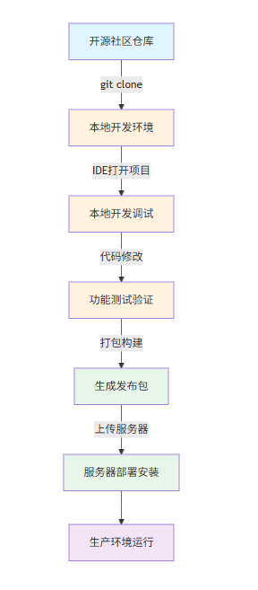
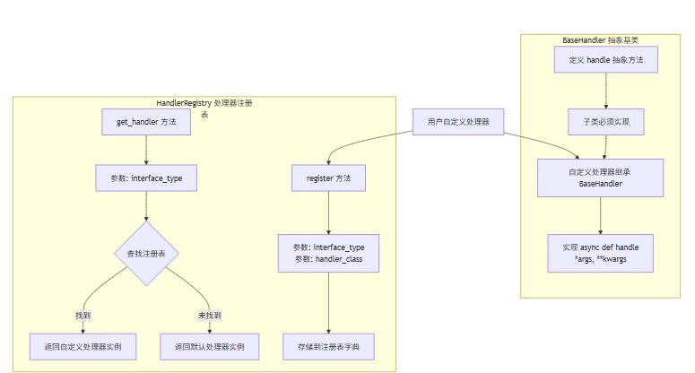

# 自定义接口使用说明

## 系统概述
系统允许用户为不同操作定义自定义实现，同时为常见操作提供默认实现。

## 主要特性
1. **抽象基类**：为所有处理器定义统一接口
2. **默认实现**：为常见操作提供内置处理器
3. **自定义扩展**：支持用户注册自定义处理器

## 安装使用

### 环境要求
- Python 3.10+
- 开发IDE（推荐 PyCharm / VS Code）

### 安装流程图


## 使用方法

### 1. 默认处理器

| 处理器类型 | 类名 | 功能说明 | 参数说明 |
|-----------|------|-------------|----------|
| DECRYPT | DecryptHandler | 处理解密操作 | `ciphertext: str` 待解密的密文 |
| AUDIT | AuditHandler | 处理审计日志 | `log_entry: Dict` 包含 operation_name, level, result, object_name, details, client_ip, user_name |
| AUTHENTICATE | AuthenticateHandler | 处理认证 | `client_ip: str`, `request: Any`, `context: Dict` (可选) |
| INSERT | InsertHandler | 处理Agent数据保存 | `agent: AgentCard`, `initial_status: str` (kwargs), `owner: str` (kwargs) |
| QUERY | QueryHandler | 处理Agent数据查询 | `name: str` (可选), `organization: str` (可选) |
| UPDATE | UpdateHandler | 处理Agent数据修改 | `name: str`, `organization: str`, `agent_data: Dict`, `owner: str` (kwargs) |
| GET | GetHandler | 处理Agent精准查询 | `name: str`, `organization: str`, `owner: str` (kwargs) |
| RETRIEVE | RetrieveHandler | 处理Agent检索 | `task: str`, `top_n: int` |
| DEREGISTER | DeregisterHandler | 处理Agent删除 | `name: str`, `organization: str`, `owner: str` (kwargs) |

### 2. 自定义处理器
**处理器调用流程图**:



**核心组件说明**:

| 组件 | 说明 | 关键方法 |
|-----|------|---------|
| **BaseHandler** | 所有处理器必须继承的抽象基类 | `handle(*args, **kwargs)` - 需要子类实现的抽象方法 |
| **HandlerRegistry** | 处理器注册表，管理处理器注册和获取 | `register(interface_type, handler_class)` - 注册处理器<br>`get_handler(interface_type)` - 获取处理器实例 |

**创建并注册自定义处理器**:

**步骤一**:在 `common/custom` 目录下新增 `__init__.py` 和 `my_custom_handle.py` 文件。

**步骤二**：在 `my_custom_handle.py` 文件中添加如下代码：
```python
from common.custom.custom_handle import BaseHandler

class MyCustomDecryptHandle(BaseHandler):
    async def handle(self, *args, **kwargs):
        # 自定义实现
        return "自定义结果"

class MyCustomAuditHandle(BaseHandler):
    async def handle(self, *args, **kwargs):
        # 自定义实现
        return "自定义结果"
```
**步骤三**：在 __init__.py 文件中注册自定义处理器
```python
from common.custom.custom_handle import HandlerRegistry
from common.custom.interface_type import InterfaceType
from common.custom.my_custom_handle import MyCustomDecryptTHandle
from common.custom.my_custom_handle import MyCustomAuditHandle

# register第一个参数interface_type为处理器类型
HandlerRegistry.register(InterfaceType.AUTHENTICATE, MyCustomDecryptTHandle)
HandlerRegistry.register(InterfaceType.AUDIT, MyCustomAuditHandle)
```
> ⚠️ **注意**：如果同一个接口注册多个自定义处理器，后注册的会覆盖前面注册的处理器。

### 3.使用处理器
使用处理器（默认或自定义）：
```python
from common.custom.custom_handle import HandlerRegistry, InterfaceType

# 获取处理器实例
handle = HandlerRegistry.get_handler(InterfaceType.QUERY)

# 使用处理器
result = await handle.handle(...)
```
> 💡 说明：上述流程由框架内部自动完成。在实际使用中，您只需调用统一的业务接口，无需关心处理器如何选择和执行。