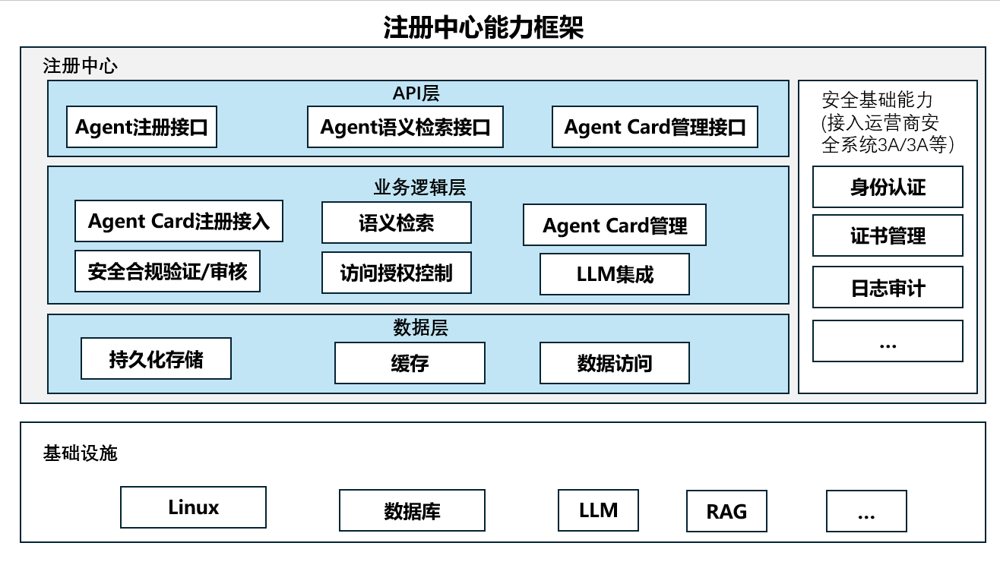

# 1.注册中心开发指南

## 1.1 注册中心功能简介

注册中心是一个专注于Agent统一管理的服务，支持用户将来自不同厂商的Agent进行集中注册与管理，实现多源Agent的可控接入与维护。主要功能包括：

- **注册AgentCard**：支持将不同厂商的Agent注册到中心，统一纳管。
- **查询AgentCard列表**：根据指定条件查询符合条件的AgentCard列表。
- **查询指定AgentCard**：按AgentCard名称和组织精确查找唯一的AgentCard实例。
- **更新指定AgentCard**：更新指定AgentCard的信息。
- **删除指定AgentCard**：删除不再使用的AgentCard。
- **按语义检索AgentCard**：根据自然语言语义检索相匹配的AgentCard。

通过这些功能，注册中心帮助用户高效整合、维护与发现各类 Agent，为上层编排与协同提供基础能力。