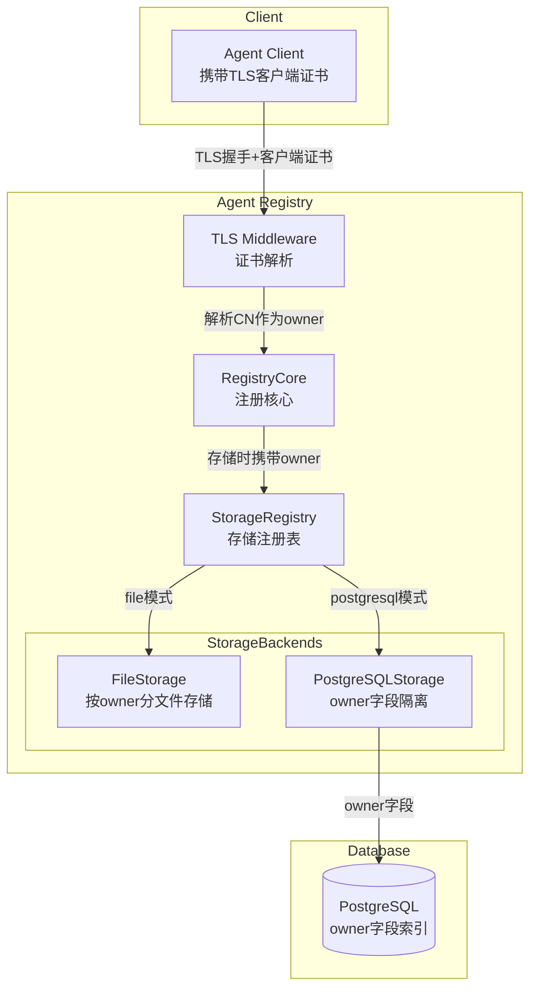
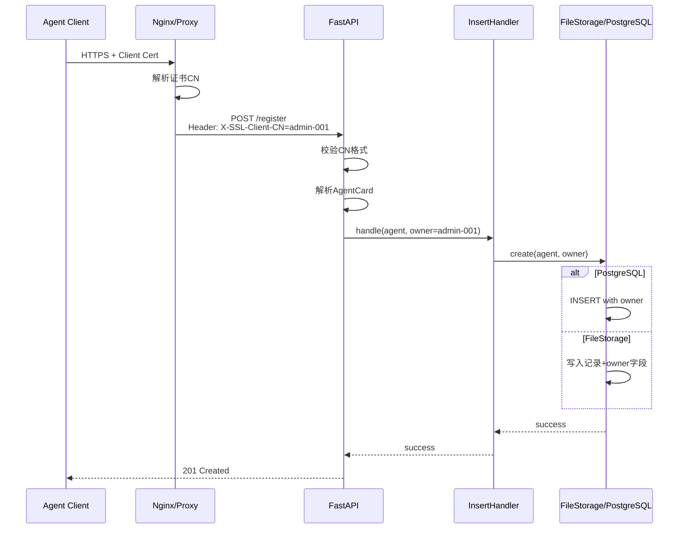
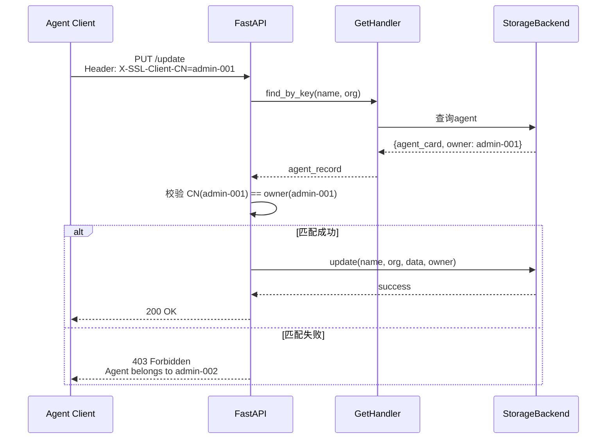

# Agent注册中心 Owner隔离方案设计

## 0. 体系架构图



---

## 1. 设计目标

### 1.1 核心需求

| 需求 | 描述 |
|------|------|
| 注册隔离 | 从TLS客户端证书提取CN作为owner，入库保存 |
| 操作鉴权 | 删除/修改时校验证书CN与库中owner匹配 |
| 多存储模式 | 文件模式和数据库模式均支持owner隔离 |

### 1.2 Owner定义

**Owner来源**: TLS客户端证书的 `Subject CN (Common Name)` 字段

证书Subject示例：
```
CN=agent-admin-001,OU=AgentOps,O=Huawei,L=Shenzhen,C=CN
```

提取逻辑：从 `subject` 字符串解析 `CN=xxx` 的值。

---

## 2. 数据模型变更

### 2.1 AgentCard扩展字段

由于AgentCard是protobuf定义的外部模型，建议采用**扩展存储**方式：

```python
# 存储时附加owner元数据
agent_record = {
    "agent_card": MessageToDict(agent, preserving_proto_field_name=True),
    "owner": "agent-admin-001",  # 新增字段
    "created_at": datetime.utcnow(),
    "updated_at": datetime.utcnow()
}
```

### 2.2 PostgreSQL表结构变更

```sql
-- 新增owner字段和索引
ALTER TABLE agent_card ADD COLUMN owner VARCHAR(100) NOT NULL DEFAULT 'system';

-- 复合唯一键：name + organization + owner
-- 允许同一agent被多个owner注册（视业务需求而定）
-- 方案A：全局唯一，一个agent只能被一个owner注册
DROP INDEX IF EXISTS agent_card_name_org_key;
CREATE UNIQUE INDEX idx_agent_unique ON agent_card(name, organization);

-- 方案B：owner隔离，同一agent可被不同owner分别注册
CREATE UNIQUE INDEX idx_agent_owner_unique ON agent_card(name, organization, owner);

-- owner查询索引
CREATE INDEX idx_agent_owner ON agent_card(owner);
```

**推荐方案A**：全局唯一，简化管理，owner仅用于权限校验。

---

## 3. 证书CN解析设计

### 3.1 CN提取工具

新增 `common/cert/cert_cn_parser.py`：

```python
"""
从X509证书Subject中提取CN字段
"""
import re
from typing import Optional

from common.cert.x509_obj import CertObj


def extract_cn_from_subject(subject: str) -> Optional[str]:
    """
    从证书Subject字符串中提取CN值
    
    Subject格式: CN=xxx,OU=yyy,O=zzz...
    支持多种格式:
    - CN=agent-admin-001,OU=...
    - CN=agent admin 001,OU=...  (带空格)
    
    Args:
        subject: RFC4514格式的Subject字符串
        
    Returns:
        CN值，若不存在返回None
    """
    if not subject:
        return None
    
    # RFC4514格式: 属性=值,属性=值
    # CN可能在任意位置，需要解析整个字符串
    pattern = r'CN=([^,]+)'
    match = re.search(pattern, subject)
    if match:
        cn_value = match.group(1).strip()
        # 处理特殊字符转义（RFC4514中逗号用\,转义）
        cn_value = cn_value.replace('\\,', ',')
        return cn_value
    
    return None


def extract_cn_from_cert(cert_obj: CertObj) -> Optional[str]:
    """
    从CertObj对象提取CN
    
    Args:
        cert_obj: CertObj实例
        
    Returns:
        CN值
    """
    return extract_cn_from_subject(cert_obj.subject)


def validate_cn(cn: str) -> bool:
    """
    校验CN是否合法
    
    规则:
    - 长度: 1-100字符
    - 允许字符: 字母、数字、下划线、连字符、点、空格
    - 禁止: 特殊符号、控制字符
    
    Args:
        cn: CN值
        
    Returns:
        是否合法
    """
    if not cn or len(cn) > 100:
        return False
    
    # 允许的字符集
    import string
    allowed_chars = string.ascii_letters + string.digits + '_-. '
    
    return all(c in allowed_chars for c in cn)
```

### 3.2 证书解析集成

修改 `common/cert/cert_parser.py`，在 `_extract_certificate_info` 中增加CN提取：

```python
def _extract_certificate_info(cert: x509.Certificate) -> CertObj:
    """从cryptography证书对象中提取信息"""
    info = {
        'subject': cert.subject.rfc4514_string(),
        'issuer': cert.issuer.rfc4514_string(),
        'serial_number': hex(cert.serial_number),
        'valid_from': cert.not_valid_before_utc.isoformat(),
        'valid_to': cert.not_valid_after_utc.isoformat(),
        'version': cert.version,
        'public_key': cert.public_key(),
        'org_cert': cert,
        'cn': extract_cn_from_subject(cert.subject.rfc4514_string())  # 新增
    }
    obj = CertObj.from_dict(info)
    return obj
```

修改 `common/cert/x509_obj.py`：

```python
class CertObj:
    subject = None
    issuer = None
    serial_number = None
    valid_from = None
    valid_to = None
    version = None
    public_key = None
    org_cert = None
    cn = None  # 新增

    @classmethod
    def from_dict(cls, cert_dict):
        obj = cls()
        obj.subject = cert_dict.get('subject', '')
        obj.issuer = cert_dict.get('issuer', '')
        obj.serial_number = cert_dict.get('serial_number', '')
        obj.valid_from = cert_dict.get('valid_from', '')
        obj.valid_to = cert_dict.get('valid_to', '')
        obj.version = cert_dict.get('version', '')
        obj.public_key = cert_dict.get('public_key', None)
        obj.org_cert = cert_dict.get('org_cert', None)
        obj.cn = cert_dict.get('cn', None)  # 新增
        return obj
```

---

## 4. REST接口改造设计

### 4.1 接口改造总览

| 接口 | 改造内容 |
|------|---------|
| POST /register | 从证书提取CN作为owner入库 |
| PUT /update | 校验证书CN与agent owner匹配 |
| DELETE /deregister | 校验证书CN与agent owner匹配 |
| GET /query | 无变更（可选：按owner过滤） |
| GET /retrieve | 无变更（可选：按owner过滤） |

### 4.2 证书获取方式

**方案选择**：通过TLS握手获取客户端证书

FastAPI中获取客户端证书：

```python
# 方案A：通过SSL context获取（推荐）
# 需要配置uvicorn SSL参数
ssl_context = ssl.create_default_context(ssl.Purpose.CLIENT_AUTH)
ssl_context.load_cert_chain(server_cert, server_key)
ssl_context.load_verify_locations(ca_cert)
ssl_context.verify_mode = ssl.CERT_REQUIRED  # 强制客户端证书

# 启动命令
uvicorn.run(app, ssl=ssl_context)

# 接口中获取证书
@app.post("/register")
async def register_agent(request: Request):
    # 从request.scope获取SSL信息
    ssl_info = request.scope.get('ssl', {})
    # 或从transport获取
    transport = request.scope.get('transport')
    # 具体获取方式依赖服务器配置
```

**方案B：通过HTTP Header传递（代理场景）**

当Agent Registry部署在反向代理后（如Nginx），由代理解析证书并传递：

```nginx
# Nginx配置
ssl_client_certificate /path/to/ca.crt;
ssl_verify_client on;

# 传递CN到后端
proxy_set_header X-SSL-Client-CN $ssl_client_s_dn_cn;
```

```python
# FastAPI获取
@app.post("/register")
async def register_agent(request: Request):
    owner = request.headers.get('X-SSL-Client-CN')
    if not owner:
        raise HTTPException(status_code=401, detail="Client certificate required")
```

**推荐方案B**：更灵活，支持代理场景。

### 4.3 注册接口改造

```python
@app.post("/rest/a2a-t/v1/agents/register")
async def register_agent(request: Request):
    """注册Agent，从证书提取owner"""
    
    # 1. 获取owner（从Header或SSL）
    owner = request.headers.get('X-SSL-Client-CN')
    if not owner:
        raise HTTPException(
            status_code=status.HTTP_401_UNAUTHORIZED,
            detail="Client certificate CN required"
        )
    
    # 2. 校验CN格式
    from common.cert.cert_cn_parser import validate_cn
    if not validate_cn(owner):
        raise HTTPException(
            status_code=status.HTTP_400_BAD_REQUEST,
            detail=f"Invalid CN format: {owner}"
        )
    
    # 3. 解析AgentCard
    body = await request.body()
    agent = Parse(body, AgentCard())
    
    # 4. 注册（携带owner）
    save_handle = HandlerRegistry.get_handler(InterfaceType.INSERT)
    success = await save_handle.handle(agent, owner=owner)
    
    return JSONResponse(content=success, status_code=status.HTTP_201_CREATED)
```

### 4.4 更新/删除接口改造

```python
async def _verify_owner_permission(
    request: Request, 
    name: str, 
    organization: str
) -> str:
    """
    校验owner权限
    
    流程:
    1. 从证书获取CN作为current_owner
    2. 查询agent获取stored_owner
    3. 比对是否匹配
    
    Returns:
        current_owner (校验成功)
        
    Raises:
        HTTPException: 证书缺失、权限不匹配
    """
    # 1. 获取当前证书CN
    current_owner = request.headers.get('X-SSL-Client-CN')
    if not current_owner:
        raise HTTPException(
            status_code=status.HTTP_401_UNAUTHORIZED,
            detail="Client certificate required"
        )
    
    # 2. 查询agent
    query_handle = HandlerRegistry.get_handler(InterfaceType.GET)
    agent = await query_handle.handle(name, organization)
    if not agent:
        raise HTTPException(
            status_code=status.HTTP_404_NOT_FOUND,
            detail=f"Agent ({name}, {organization}) not found"
        )
    
    # 3. 获取存储的owner
    stored_owner = agent.get('owner', 'system')  # 兼容旧数据
    
    # 4. 权限校验
    if current_owner != stored_owner:
        raise HTTPException(
            status_code=status.HTTP_403_FORBIDDEN,
            detail=f"Permission denied: agent belongs to {stored_owner}"
        )
    
    return current_owner


@app.put("/rest/a2a-t/v1/update_agent/{name}")
async def update_agent(request: Request, name: str, organization: str):
    """更新Agent，校验owner权限"""
    
    # 1. 权限校验
    owner = await _verify_owner_permission(request, name, organization)
    
    # 2. 执行更新
    body = await request.body()
    agent_data = Parse(body, AgentCard())
    
    update_handle = HandlerRegistry.get_handler(InterfaceType.UPDATE)
    success = await update_handle.handle(name, organization, agent_data, owner=owner)
    
    return success


@app.delete("/rest/a2a-t/v1/deregister_agent/{name}")
async def deregister_agent(request: Request, name: str, organization: str):
    """注销Agent，校验owner权限"""
    
    # 1. 权限校验
    owner = await _verify_owner_permission(request, name, organization)
    
    # 2. 执行删除
    deregister_handle = HandlerRegistry.get_handler(InterfaceType.DEREGISTER)
    success = await deregister_handle.handle(name, organization, owner=owner)
    
    return success
```

---

## 5. 存储层改造设计

### 5.1 StorageBackend接口扩展

```python
# agent_registry/persistence/base.py
class StorageBackend(ABC):
    @abstractmethod
    def create(self, agent: AgentCard, owner: str) -> bool:
        """注册Agent，携带owner"""
        pass
    
    @abstractmethod
    def find_by_key(self, name: str, organization: str) -> Optional[Dict]:
        """查询Agent，返回包含owner的完整记录"""
        pass
    
    @abstractmethod
    def find_by_owner(self, owner: str) -> List[AgentCard]:
        """按owner查询（新增）"""
        pass
    
    @abstractmethod
    def update(self, name: str, organization: str, agent_data: Dict, owner: str) -> bool:
        """更新Agent，携带owner校验"""
        pass
    
    @abstractmethod
    def delete(self, name: str, organization: str, owner: str) -> bool:
        """删除Agent，携带owner校验"""
        pass
```

### 5.2 PostgreSQL存储改造

```python
# agent_registry/persistence/sql_queries.py 新增
class PostgreSQLQueries(str, Enum):
    # ... 现有语句 ...
    
    # 新增owner相关
    CREATE_AGENT_WITH_OWNER = """
        INSERT INTO agent_card (name, organization, owner, agent_card_json, created_at, updated_at)
        VALUES ($1, $2, $3, $4, $5, $6)
        ON CONFLICT (name, organization) DO NOTHING
    """
    
    FIND_BY_OWNER = """
        SELECT agent_card_json, owner FROM agent_card WHERE owner = $1
    """
    
    UPDATE_AGENT_WITH_OWNER_CHECK = """
        UPDATE agent_card 
        SET agent_card_json = $3, updated_at = $4
        WHERE name = $1 AND organization = $2 AND owner = $5
    """
    
    DELETE_AGENT_WITH_OWNER_CHECK = """
        DELETE FROM agent_card 
        WHERE name = $1 AND organization = $2 AND owner = $3
    """
```

```python
# agent_registry/persistence/postgresql_storage.py 改造
class PostgreSQLStorage(StorageBackend):
    
    def create(self, agent: AgentCard, owner: str) -> bool:
        conn = self.pool.getconn()
        try:
            with conn.cursor() as cur:
                agent_dict = MessageToDict(agent, preserving_proto_field_name=True)
                now = datetime.utcnow()
                cur.execute(
                    PostgreSQLQueries.CREATE_AGENT_WITH_OWNER.value,
                    (agent.name, agent.provider.organization, owner, 
                     json.dumps(agent_dict), now, now)
                )
                conn.commit()
            return cur.rowcount > 0
        finally:
            self.pool.putconn(conn)
    
    def find_by_key(self, name: str, organization: str) -> Optional[Dict]:
        """返回包含owner的完整记录"""
        conn = self.pool.getconn()
        try:
            with conn.cursor() as cur:
                cur.execute(
                    PostgreSQLQueries.FIND_BY_KEY.value,
                    (name, organization)
                )
                row = cur.fetchone()
            if row:
                data = row[0] if isinstance(row[0], dict) else json.loads(row[0])
                owner = row[1] if len(row) > 1 else 'system'
                return {"agent_card": AgentCard(**data), "owner": owner}
            return None
        finally:
            self.pool.putconn(conn)
    
    def update(self, name: str, organization: str, agent_data: Dict, owner: str) -> bool:
        conn = self.pool.getconn()
        try:
            with conn.cursor() as cur:
                now = datetime.utcnow()
                cur.execute(
                    PostgreSQLQueries.UPDATE_AGENT_WITH_OWNER_CHECK.value,
                    (name, organization, json.dumps(agent_data), now, owner)
                )
                conn.commit()
                affected = cur.rowcount
            return affected > 0
        finally:
            self.pool.putconn(conn)
    
    def delete(self, name: str, organization: str, owner: str) -> bool:
        conn = self.pool.getconn()
        try:
            with conn.cursor() as cur:
                cur.execute(
                    PostgreSQLQueries.DELETE_AGENT_WITH_OWNER_CHECK.value,
                    (name, organization, owner)
                )
                conn.commit()
                affected = cur.rowcount
            return affected > 0
        finally:
            self.pool.putconn(conn)
```

### 5.3 文件存储改造（推荐方案）

#### 方案A：单文件存储 + owner元数据

**结构**：单个JSON文件，每条记录携带owner字段

```json
// data/agents.json
[
    {
        "name": "agent-001",
        "organization": "org-A",
        "owner": "admin-001",
        "agent_card": {...},
        "created_at": "2026-01-01T00:00:00Z"
    },
    {
        "name": "agent-002",
        "organization": "org-B",
        "owner": "admin-002",
        "agent_card": {...}
    }
]
```

**优点**：
- 实现简单，改动小
- 跨owner查询方便
- 数据迁移平滑

**缺点**：
- 大文件性能问题（已有max_file_size限制）
- 无物理隔离

```python
# agent_registry/persistence/file_storage.py 改造
class FileStorage(StorageBackend):
    
    def create(self, agent: AgentCard, owner: str) -> bool:
        key = (agent.name.strip(), agent.provider.organization.strip())
        agent_dict = MessageToDict(agent, preserving_proto_field_name=True)
        
        # 存储结构：包含owner元数据
        record = {
            "name": agent.name,
            "organization": agent.provider.organization,
            "owner": owner,
            "agent_card": agent_dict,
            "created_at": datetime.utcnow().isoformat(),
            "updated_at": datetime.utcnow().isoformat()
        }
        
        self._agents[key] = record
        self._save()
        return True
    
    def find_by_key(self, name: str, organization: str) -> Optional[Dict]:
        key = (name.strip(), organization.strip())
        record = self._agents.get(key)
        if record:
            return {
                "agent_card": AgentCard(**record["agent_card"]),
                "owner": record.get("owner", "system")
            }
        return None
    
    def update(self, name: str, organization: str, agent_data: Dict, owner: str) -> bool:
        key = (name.strip(), organization.strip())
        record = self._agents.get(key)
        if not record:
            return False
        
        # 校验owner
        if record.get("owner", "system") != owner:
            raise PermissionError(f"Agent belongs to {record['owner']}")
        
        record["agent_card"] = agent_data
        record["updated_at"] = datetime.utcnow().isoformat()
        self._agents[key] = record
        self._save()
        return True
    
    def delete(self, name: str, organization: str, owner: str) -> bool:
        key = (name.strip(), organization.strip())
        record = self._agents.get(key)
        if not record:
            return False
        
        # 校验owner
        if record.get("owner", "system") != owner:
            raise PermissionError(f"Agent belongs to {record['owner']}")
        
        del self._agents[key]
        self._save()
        return True
    
    def _save(self) -> None:
        # 保存完整记录（包含owner）
        records = []
        for record in self._agents.values():
            records.append(record)
        
        json_str = json.dumps(records, ensure_ascii=False, indent=2)
        # ... 大小检查和写入逻辑 ...
```

#### 方案B：按owner分目录存储（物理隔离）

**目录结构**：
```
data/
├── agents/                     # 主索引（可选）
│   └── index.json              # name->owner映射
├── owner_admin-001/            # owner专属目录
│   ├── agent-001_org-A.json
│   └── agent-003_org-C.json
├── owner_admin-002/
│   ├── agent-002_org-B.json
│   └── ...
└── owner_system/               # 系统级agent
    └── default_agent.json
```

**优点**：
- 物理隔离，权限边界清晰
- 单owner数据量可控
- 便于备份/迁移特定owner数据

**缺点**：
- 实现复杂
- 跨owner查询需遍历目录
- 数据迁移需重构

```python
# agent_registry/persistence/file_storage_owner_split.py
"""
按owner分目录存储实现
"""
import os
from pathlib import Path
from typing import Dict, Optional

class OwnerSplitFileStorage(StorageBackend):
    
    def __init__(self, data_dir: str = "data/agents"):
        self.data_dir = Path(data_dir)
        self.data_dir.mkdir(parents=True, exist_ok=True)
        self._index: Dict[tuple, str] = {}  # (name, org) -> owner
        self._load_index()
    
    def _get_owner_dir(self, owner: str) -> Path:
        """获取owner专属目录"""
        owner_dir = self.data_dir / f"owner_{owner}"
        owner_dir.mkdir(exist_ok=True)
        # 设置目录权限（仅owner可访问）
        os.chmod(owner_dir, 0o700)
        return owner_dir
    
    def _get_agent_file(self, owner: str, name: str, org: str) -> Path:
        """获取agent存储文件路径"""
        owner_dir = self._get_owner_dir(owner)
        # 文件名：name_org.json（处理特殊字符）
        safe_name = name.replace('/', '_').replace('\\', '_')
        safe_org = org.replace('/', '_').replace('\\', '_')
        return owner_dir / f"{safe_name}_{safe_org}.json"
    
    def create(self, agent: AgentCard, owner: str) -> bool:
        key = (agent.name.strip(), agent.provider.organization.strip())
        
        # 检查是否已存在
        if key in self._index:
            return False
        
        # 存储agent文件
        agent_file = self._get_agent_file(owner, agent.name, agent.provider.organization)
        agent_dict = MessageToDict(agent, preserving_proto_field_name=True)
        
        record = {
            "agent_card": agent_dict,
            "owner": owner,
            "created_at": datetime.utcnow().isoformat()
        }
        
        with open(agent_file, 'w', encoding='utf-8') as f:
            json.dump(record, f, ensure_ascii=False, indent=2)
        os.chmod(agent_file, 0o600)
        
        # 更新索引
        self._index[key] = owner
        self._save_index()
        
        return True
    
    def find_by_key(self, name: str, organization: str) -> Optional[Dict]:
        key = (name.strip(), organization.strip())
        owner = self._index.get(key)
        
        if not owner:
            return None
        
        agent_file = self._get_agent_file(owner, name, organization)
        if not agent_file.exists():
            return None
        
        with open(agent_file, 'r', encoding='utf-8') as f:
            record = json.load(f)
        
        return {
            "agent_card": AgentCard(**record["agent_card"]),
            "owner": record["owner"]
        }
    
    def update(self, name: str, organization: str, agent_data: Dict, owner: str) -> bool:
        key = (name.strip(), organization.strip())
        stored_owner = self._index.get(key)
        
        if not stored_owner:
            return False
        
        if stored_owner != owner:
            raise PermissionError(f"Agent belongs to {stored_owner}")
        
        agent_file = self._get_agent_file(owner, name, organization)
        
        record = {
            "agent_card": agent_data,
            "owner": owner,
            "updated_at": datetime.utcnow().isoformat()
        }
        
        with open(agent_file, 'w', encoding='utf-8') as f:
            json.dump(record, f, ensure_ascii=False, indent=2)
        
        return True
    
    def delete(self, name: str, organization: str, owner: str) -> bool:
        key = (name.strip(), organization.strip())
        stored_owner = self._index.get(key)
        
        if not stored_owner:
            return False
        
        if stored_owner != owner:
            raise PermissionError(f"Agent belongs to {stored_owner}")
        
        agent_file = self._get_agent_file(owner, name, organization)
        if agent_file.exists():
            agent_file.unlink()
        
        del self._index[key]
        self._save_index()
        
        return True
    
    def find_by_owner(self, owner: str) -> List[AgentCard]:
        """查询特定owner的所有agent"""
        owner_dir = self._get_owner_dir(owner)
        agents = []
        
        for agent_file in owner_dir.glob("*.json"):
            with open(agent_file, 'r', encoding='utf-8') as f:
                record = json.load(f)
            agents.append(AgentCard(**record["agent_card"]))
        
        return agents
    
    def _load_index(self):
        """加载索引"""
        index_file = self.data_dir / "index.json"
        if index_file.exists():
            with open(index_file, 'r', encoding='utf-8') as f:
                index_data = json.load(f)
            for entry in index_data:
                self._index[(entry["name"], entry["organization"])] = entry["owner"]
    
    def _save_index(self):
        """保存索引"""
        index_file = self.data_dir / "index.json"
        index_data = [
            {"name": k[0], "organization": k[1], "owner": v}
            for k, v in self._index.items()
        ]
        with open(index_file, 'w', encoding='utf-8') as f:
            json.dump(index_data, f, ensure_ascii=False, indent=2)
```

### 5.4 文件存储方案推荐

| 场景 | 推荐方案 |
|------|---------|
| 少量owner (<10) | 方案A：单文件+owner字段，简单高效 |
| 多owner + 物理隔离需求 | 方案B：按owner分目录 |
| 需要平滑迁移 | 方案A，后续可迁移到方案B |

**默认推荐方案A**，实现简单，兼容现有架构。

---

## 6. Handler改造设计

### 6.1 InsertHandler改造

```python
# common/custom/custom_handle.py
class InsertHandler(Handler):
    async def handle(self, agent: AgentCard, owner: str = None) -> bool:
        """注册Agent，携带owner"""
        if owner is None:
            owner = 'system'  # 默认owner
        
        registry = get_registry()
        return registry.register(agent, owner=owner)
```

### 6.2 UpdateHandler改造

```python
class UpdateHandler(Handler):
    async def handle(self, name: str, organization: str, 
                     agent_data: dict, owner: str = None) -> bool:
        """更新Agent，携带owner校验"""
        registry = get_registry()
        return registry.update(name, organization, agent_data, owner=owner)
```

### 6.3 DeregisterHandler改造

```python
class DeregisterHandler(Handler):
    async def handle(self, name: str, organization: str, 
                     owner: str = None) -> bool:
        """注销Agent，携带owner校验"""
        registry = get_registry()
        return registry.deregister(name, organization, owner=owner)
```

### 6.4 GetHandler改造

```python
class GetHandler(Handler):
    async def handle(self, name: str, organization: str) -> Optional[Dict]:
        """查询Agent，返回包含owner的记录"""
        registry = get_registry()
        return registry.get_by_key(name, organization)
```

---

## 7. RegistryCore改造

```python
# agent_registry/core.py
class RegistryCore:
    
    def register(self, agent: AgentCard, owner: str = 'system', 
                 use_vectordb: bool = USE_VECTORDB) -> bool:
        """注册Agent，携带owner"""
        with self._lock:
            if use_vectordb:
                # vectordb模式：存储时包含owner
                entity_str = json.dumps(MessageToDict(agent, preserving_proto_field_name=True))
                embedding = self.embedding_tool.get_embedding_vector(agent.description)
                id = self._make_id(agent.name, agent.provider.organization)
                insert_entity = {
                    "embedding": embedding,
                    "id": id,
                    "name": agent.name,
                    "description": agent.description,
                    "organization": agent.provider.organization,
                    "agent_card": entity_str,
                    "owner": owner  # 新增
                }
                insert_data = {"collection_name": COLLECTION_NAME, "entity": insert_entity}
                return self.vectordb.insert_entity(insert_data)
            elif self.persistence_mode == 'postgresql':
                return self.storage.create(agent, owner)
            else:
                return self.storage.create(agent, owner)
    
    def get_by_key(self, name: str, organization: str, 
                   use_vectordb: bool = USE_VECTORDB) -> Optional[Dict]:
        """查询Agent，返回包含owner的记录"""
        if use_vectordb:
            query_data = {"collection_name": COLLECTION_NAME, "key": "id", 
                          "value": self._make_id(name, organization)}
            results = self.vectordb.query_by_key(query_data)
            if results:
                result = results[0]
                return {
                    "agent_card": AgentCard(**result.get("agent_card", {})),
                    "owner": result.get("owner", "system")
                }
            return None
        elif self.persistence_mode == 'postgresql':
            return self.storage.find_by_key(name, organization)
        else:
            return self.storage.find_by_key(name, organization)
    
    def update(self, name: str, organization: str, agent_data: Dict, 
               owner: str = 'system', use_vectordb: bool = USE_VECTORDB) -> bool:
        """更新Agent，携带owner校验"""
        if use_vectordb:
            # vectordb更新时校验owner
            existing = self.get_by_key(name, organization)
            if not existing or existing.get("owner") != owner:
                raise PermissionError(f"Permission denied")
            # ... vectordb更新逻辑 ...
        elif self.persistence_mode == 'postgresql':
            return self.storage.update(name, organization, agent_data, owner)
        else:
            return self.storage.update(name, organization, agent_data, owner)
    
    def deregister(self, name: str, organization: str, owner: str = 'system',
                   use_vectordb: bool = USE_VECTORDB) -> bool:
        """注销Agent，携带owner校验"""
        if use_vectordb:
            existing = self.get_by_key(name, organization)
            if not existing or existing.get("owner") != owner:
                raise PermissionError(f"Permission denied")
            # ... vectordb删除逻辑 ...
        elif self.persistence_mode == 'postgresql':
            return self.storage.delete(name, organization, owner)
        else:
            return self.storage.delete(name, organization, owner)
```

---

## 8. 配置变更

### 8.1 新增配置项

```properties
# etc/conf/persistence.conf 新增

# Owner隔离开关
owner.isolation.enabled=true

# Owner校验严格模式
# strict: 严格校验，无证书CN则拒绝
# relaxed: 宽松模式，无CN时使用默认owner
owner.validation.mode=strict

# 默认owner（当无证书CN时使用）
owner.default=system

# 文件存储owner隔离模式
# single_file: 单文件+owner字段
# owner_split: 按owner分目录
file.storage.owner.mode=single_file
```

### 8.2 配置加载

```python
# agent_registry/config.py 新增
OWNER_ISOLATION_ENABLED = get_conf().get('owner.isolation.enabled', 'true').lower() == 'true'
OWNER_VALIDATION_MODE = get_conf().get('owner.validation.mode', 'strict')
OWNER_DEFAULT = get_conf().get('owner.default', 'system')
FILE_STORAGE_OWNER_MODE = get_conf().get('file.storage.owner.mode', 'single_file')
```

---

## 9. 向量数据库改造（可选）

若使用Milvus向量数据库，需扩展collection schema：

```python
# collection定义增加owner字段
fields = [
    FieldSchema(name="id", dtype=DataType.VARCHAR, max_length=256, is_primary=True),
    FieldSchema(name="embedding", dtype=DataType.FLOAT_VECTOR, dim=1024),
    FieldSchema(name="name", dtype=DataType.VARCHAR, max_length=100),
    FieldSchema(name="organization", dtype=DataType.VARCHAR, max_length=100),
    FieldSchema(name="description", dtype=DataType.VARCHAR, max_length=1000),
    FieldSchema(name="agent_card", dtype=DataType.VARCHAR, max_length=65535),
    FieldSchema(name="owner", dtype=DataType.VARCHAR, max_length=100),  # 新增
]

# 创建owner索引
index_params = {
    "field_name": "owner",
    "index_type": "Trie",
    "metric_type": "UNKNOWN"
}
collection.create_index("owner", index_params)
```

---

## 10. 流程图

### 10.1 注册流程



### 10.2 更新/删除流程



---

## 11. 测试设计

| 测试用例 | 描述 |
|---------|------|
| test_cn_extraction | CN字段解析正确性 |
| test_cn_validation | CN格式校验 |
| test_register_with_owner | 注册携带owner |
| test_update_owner_match | 更新时owner匹配成功 |
| test_update_owner_mismatch | 更新时owner不匹配拒绝 |
| test_delete_owner_match | 删除时owner匹配成功 |
| test_delete_owner_mismatch | 删除时owner不匹配拒绝 |
| test_file_storage_owner | 文件存储owner隔离 |
| test_postgresql_storage_owner | PostgreSQL存储owner隔离 |
| test_default_owner | 无证书CN时使用默认owner |

---

## 12. 文件清单

### 新增文件

| 文件路径 | 说明 |
|---------|------|
| `common/cert/cert_cn_parser.py` | CN解析工具 |
| `agent_registry/persistence/file_storage_owner_split.py` | 按owner分目录存储（可选） |

### 修改文件

| 文件 | 改动 |
|------|------|
| `common/cert/cert_parser.py` | `_extract_certificate_info`增加CN提取 |
| `common/cert/x509_obj.py` | `CertObj`增加cn属性 |
| `agent_registry/persistence/base.py` | 接口增加owner参数 |
| `agent_registry/persistence/file_storage.py` | 实现owner隔离 |
| `agent_registry/persistence/postgresql_storage.py` | 实现owner隔离 |
| `agent_registry/persistence/sql_queries.py` | 新增owner相关SQL |
| `agent_registry/core.py` | 方法增加owner参数 |
| `agent_registry/server.py` | 接口改造，提取和校验owner |
| `common/custom/custom_handle.py` | Handler增加owner参数 |
| `agent_registry/config.py` | 新增owner相关配置 |

---

## 13. 实现计划

| 阶段 | 内容 | 优先级 |
|------|------|--------|
| 1 | CN解析工具 `cert_cn_parser.py` | P0 |
| 2 | 证书解析集成（cert_parser/x509_obj） | P0 |
| 3 | PostgreSQL表结构变更 | P0 |
| 4 | StorageBackend接口扩展 | P0 |
| 5 | PostgreSQL存储owner实现 | P0 |
| 6 | 文件存储owner实现（方案A） | P0 |
| 7 | Handler改造 | P0 |
| 8 | RegistryCore改造 | P0 |
| 9 | REST接口改造 | P0 |
| 10 | 配置项新增 | P1 |
| 11 | 文件存储方案B实现（可选） | P2 |
| 12 | 向量数据库owner扩展（可选） | P2 |
| 13 | 单元测试 | P0 |

---

## 14. 文件存储方案选择建议

### 场景分析

| 场景 | agent数量 | owner数量 | 推荐方案 |
|------|----------|----------|---------|
| 开发/测试环境 | <100 | <5 | 方案A：单文件 |
| 小规模生产 | <1000 | <20 | 方案A：单文件 |
| 大规模生产 | >1000 | >50 | 方案B：分目录 |
| 安全合规要求高 | - | - | 方案B：分目录 |

### 方案A详细说明

**适用场景**：
- 绝大多数场景（agent数量在max_file_size限制内）
- 需要平滑迁移的存量系统
- 查询性能要求高的场景（单文件索引更快）

**实现要点**：
- 每条记录增加 `owner` 字段
- 读写时携带owner校验
- 权限校验在业务层完成

### 方案B详细说明

**适用场景**：
- agent数量巨大（超过单文件性能阈值）
- 需要物理隔离的合规场景
- 按owner备份/迁移需求

**实现要点**：
- 按owner创建独立目录
- 维护全局索引（name+org → owner映射）
- 目录权限设置（0o700）

### 迁移路径

```
阶段1: 方案A（单文件+owner字段） → 系统上线
阶段2: 数据量增长 → 监控性能
阶段3: 达到阈值 → 迁移到方案B
       迁移工具：读取单文件，按owner拆分到目录
```

---

## 15. 安全注意事项

1. **CN校验**：严格校验CN格式，防止注入
2. **目录权限**：owner目录设置0o700，文件设置0o600
3. **日志脱敏**：审计日志中owner脱敏处理
4. **向后兼容**：存量数据默认owner='system'
5. **代理信任**：X-SSL-Client-CN Header来源可信