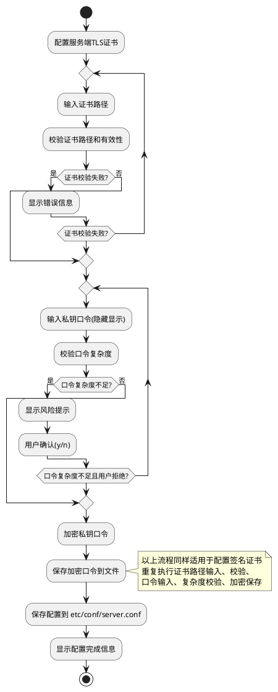
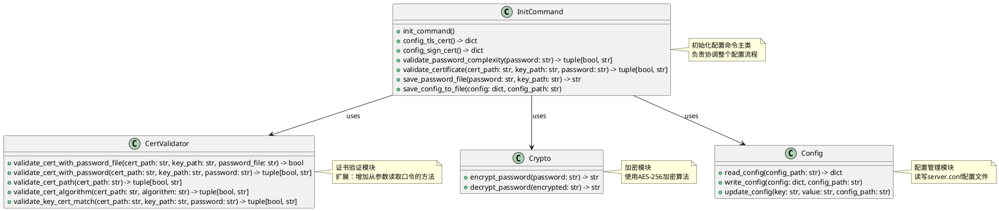
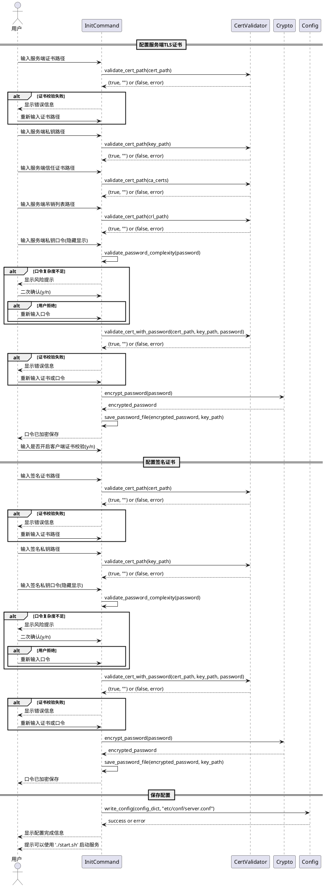

# Agent Registry Init 命令设计文档

## 1与其他模块交互

### 1.1 依赖模块
- **证书验证模块**：common/cert_validator.py
  - 使用现有证书校验函数验证证书有效性
  - 需要扩展：增加从明文口令参数读取私钥口令的方法

- **加密模块**：common/crypto.py
  - 使用现有加密函数对私钥口令进行加密
  - 加密后的口令保存到指定文件

- **配置模块**：common/config.py
  - 读取和写入 etc/conf/server.conf 配置文件

### 1.2 调用关系
```
agent_registry/init.py
├── common/cert_validator.py (证书校验)
├── common/crypto.py (口令加密)
└── common/config.py (配置读写)
```

## 2 功能描述

### 2.1 命令入口
```bash
python agent-registry init
```

### 2.2 配置流程
1. 配置服务端TLS证书（仅支持RSA算法）
2. 配置签名证书（仅支持RSA算法）
3. 保存配置到 etc/conf/server.conf

### 2.3 配置项

#### 2.3.1 服务端TLS证书配置
| 配置项 | 说明 | 默认值 |
|--------|------|--------|
| ssl_certfile | 服务端证书路径 | etc/ssl/service/server_rsa.cer |
| ssl_keyfile | 服务端私钥路径 | etc/ssl/service/server_key_rsa.pem |
| ssl_ca_certs | 服务端信任证书路径 | etc/ssl/service/trust.cer |
| ssl_cert_certs | 服务端吊销列表文件路径 | etc/ssl/service/revovationlist.crl |
| ssl_keyfile_password | 服务端私钥口令（隐藏输入） | - |
| ssl_verify_client | 是否开启客户端证书校验 | y |

#### 2.3.2 签名证书配置
| 配置项 | 说明 | 默认值 |
|--------|------|--------|
| sign_certfile | 签名证书路径 | etc/sign_cert/server_rsa.cer |
| sign_keyfile | 签名私钥路径 | etc/sign_cert/server_key_rsa.pem |
| sign_keyfile_password | 签名私钥口令（隐藏输入） | - |

## 3 输入参数校验

### 3.1 私钥口令校验
**校验规则**：
- 长度至少8个字符
- 至少包含两种字符类型（数字、大写字母、小写字母、特殊字符）

**处理流程**：
1. 用户输入口令（隐藏显示）
2. 校验口令复杂度
3. 如果不满足要求，提示风险信息
4. 要求用户二次确认后继续使用

**风险提示示例**：
```
警告：私钥口令不满足复杂度要求（至少8个字符，包含至少两种字符类型）
是否继续使用该口令？(y/n):
```

### 3.2 证书路径校验
**支持的路径类型**：
- 绝对路径：/path/to/cert.cer 或 C:\path\to\cert.cer
- 相对路径：etc/ssl/service/server_rsa.cer

**校验规则**：
- 路径格式正确
- 文件存在
- 文件可读

### 3.3 证书校验
**校验内容**：
- 证书文件存在
- 证书格式正确
- 证书算法为RSA
- 私钥与证书匹配
- 证书链有效（对于CA证书）

**失败处理**：
- 显示失败原因
- 重新输入或退出

## 4 处理过程

### 4.1 配置流程图



### 4.2 口令加密和存储

#### 4.2.1 口令加密
- 使用现有加密函数（common/crypto.py）
- 加密算法：AES-256
- 加密密钥：从系统环境或配置获取

#### 4.2.2 口令文件存储路径
| 原私钥文件 | 口令文件路径 |
|-----------|-------------|
| etc/ssl/service/server_key_rsa.pem | etc/ssl/service/server_key_rsa_pwd |
| etc/sign_cert/server_key_rsa.pem | etc/sign_cert/server_key_rsa_pwd |

**命名规则**：
```
{私钥文件目录}/{私钥文件名（不带后缀）}_pwd
```

#### 4.2.3 口令文件权限
- 文件权限：600（仅所有者可读写）
- 目录权限：700（仅所有者可访问）

### 4.3 配置文件格式

#### 4.3.1 server.conf 格式
```ini
[ssl]
ssl_certfile=etc/ssl/service/server_rsa.cer
ssl_keyfile=etc/ssl/service/server_key_rsa.pem
ssl_keyfile_password=etc/ssl/service/server_key_rsa_pwd
ssl_ca_certs=etc/ssl/service/trust.cer
ssl_cert_certs=etc/ssl/service/revovationlist.crl
ssl_verify_client=true

[sign]
sign_certfile=etc/sign_cert/server_rsa.cer
sign_keyfile=etc/sign_cert/server_key_rsa.pem
sign_keyfile_password=etc/sign_cert/server_key_rsa_pwd
```

## 5. 接口设计

### 5.1 类图



### 5.2 主要函数

##### 5.2.1 init_command()
```python
def init_command():
    """
    初始化配置命令入口
    """
    pass
```

#### 5.2.2 config_tls_cert()
```python
def config_tls_cert() -> dict:
    """
    配置服务端TLS证书
    返回配置字典
    """
    pass
```

#### 5.2.3 config_sign_cert()
```python
def config_sign_cert() -> dict:
    """
    配置签名证书
    返回配置字典
    """
    pass
```

#### 5.2.4 validate_password_complexity(password: str) -> tuple[bool, str]
```python
def validate_password_complexity(password: str) -> tuple[bool, str]:
    """
    校验口令复杂度
    返回：(是否通过, 错误信息)
    """
    pass
```

#### 5.2.5 validate_certificate(cert_path: str, key_path: str, password: str) -> tuple[bool, str]
```python
def validate_certificate(cert_path: str, key_path: str, password: str) -> tuple[bool, str]:
    """
    校验证书和私钥
    返回：(是否通过, 错误信息)
    """
    pass
```

#### 5.2.6 save_password_file(password: str, key_path: str) -> str
```python
def save_password_file(password: str, key_path: str) -> str:
    """
    加密并保存口令到文件
    返回口令文件路径
    """
    pass
```

#### 5.2.7 save_config_to_file(config: dict, config_path: str)
```python
def save_config_to_file(config: dict, config_path: str):
    """
    保存配置到文件
    """
    pass
```

### 5.3 证书验证模块扩展

#### 5.3.1 现有函数（从文件读取口令）
```python
def validate_cert_with_password_file(cert_path: str, key_path: str, password_file: str) -> bool:
    """
    从口令文件读取并解密私钥口令，验证证书
    """
    pass
```

#### 5.3.2 新增函数（从参数读取口令）
```python
def validate_cert_with_password(cert_path: str, key_path: str, password: str) -> tuple[bool, str]:
    """
    从明文口令参数读取私钥口令，验证证书
    返回：(是否通过, 错误信息)
    """
    pass
```

## 6 交互示例

### 6.1 时序图



### 6.2 正常流程
```
$ python agent-registry init

配置服务端TLS证书：（仅支持RSA算法）
请输入服务端证书路径 ssl_certfile: (default: etc/ssl/service/server_rsa.cer)
请输入服务端私钥路径 ssl_keyfile: (default: etc/ssl/service/server_key_rsa.pem)
请输入服务端信任证书路径 ssl_ca_certs: (default: etc/ssl/service/trust.cer)
请输入服务端吊销列表文件路径 ssl_cert_certs: (default: etc/ssl/service/revovationlist.crl)
请输入服务端私钥口令: ********
是否开启客户端证书校验 verify_client (y/n, default: y): y

配置签名证书：（仅支持RSA算法）
请输入签名证书路径: (default: etc/sign_cert/server_rsa.cer)
请输入签名私钥路径: (default: etc/sign_cert/server_key_rsa.pem)
请输入签名私钥口令: ********

配置已完成，已保存在 etc/conf/server.conf
ssl_certfile=etc/ssl/service/server_rsa.cer
ssl_keyfile=etc/ssl/service/server_key_rsa.pem
ssl_keyfile_password=etc/ssl/service/server_key_rsa_pwd
ssl_ca_certs=etc/ssl/service/trust.cer
ssl_cert_certs=etc/ssl/service/revovationlist.crl
ssl_verify_client=true
sign_certfile=etc/sign_cert/server_rsa.cer
sign_keyfile=etc/sign_cert/server_key_rsa.pem
sign_keyfile_password=etc/sign_cert/server_key_rsa_pwd

您可以使用 './start.sh' 启动服务
```

### 6.3 口令复杂度警告
```
请输入服务端私钥口令: ********
警告：私钥口令不满足复杂度要求（至少8个字符，包含至少两种字符类型）
是否继续使用该口令？ (y/n): y
```

### 6.4 证书校验失败
```
请输入服务端证书路径 ssl_certfile: /invalid/path/cert.cer
错误：证书文件不存在或无法读取：/invalid/path/cert.cer
请重新输入服务端证书路径 ssl_certfile: (default: etc/ssl/service/server_rsa.cer)
```

### 6.3 证书校验失败
```
请输入服务端证书路径 ssl_certfile: /invalid/path/cert.cer
错误：证书文件不存在或无法读取：/invalid/path/cert.cer
请重新输入服务端证书路径 ssl_certfile: (default: etc/ssl/service/server_rsa.cer)
```

## 7 错误处理

### 7.1 错误码定义
| 错误码 | 说明 |
|--------|------|
| ERR_CERT_NOT_FOUND | 证书文件不存在 |
| ERR_CERT_INVALID | 证书格式无效 |
| ERR_CERT_ALGORITHM | 证书算法不支持（仅支持RSA） |
| ERR_KEY_MISMATCH | 私钥与证书不匹配 |
| ERR_PASSWORD_WEAK | 口令复杂度不足 |
| ERR_CONFIG_SAVE | 配置文件保存失败 |
| ERR_PASSWORD_ENCRYPT | 口令加密失败 |

### 7.2 错误处理策略
- 证书校验失败：提示错误原因，允许重新输入
- 口令复杂度不足：提示风险，要求二次确认
- 配置保存失败：显示错误信息，退出
- 加密失败：显示错误信息，退出

## 8 安全考虑

### 8.1 口令安全
- 输入时隐藏显示
- 使用 AES-256 加密存储
- 口令文件权限设置为 600
- 避免在日志中记录口令

### 8.2 文件权限
- 口令文件：600
- 配置文件：644
- 证书文件：644
- 私钥文件：600

### 8.3 其他安全措施
- 证书路径验证，防止路径遍历攻击
- 限制配置文件大小
- 定期轮换加密密钥

## 9 测试计划

### 9.1 单元测试
- 口令复杂度校验测试
- 证书路径校验测试
- 证书验证测试
- 口令加密和存储测试
- 配置文件读写测试

### 9.2 集成测试
- 完整配置流程测试
- 错误处理测试
- 交互式输入测试

### 9.3 测试用例
| 测试用例 | 输入 | 预期结果 |
|---------|------|---------|
| 正常配置 | 有效证书和口令 | 配置成功 |
| 弱口令确认 | 弱口令 + 确认 | 配置成功 |
| 弱口令拒绝 | 弱口令 + 拒绝 | 重新输入 |
| 无效证书 | 无效证书路径 | 提示错误，重新输入 |
| 非RSA证书 | ECDSA证书 | 提示错误，重新输入 |

## 10 实现优先级

### P0（必须实现）
- 基本配置流程
- 证书路径校验
- 口令复杂度校验
- 口令加密存储
- 配置文件保存

### P1（重要）
- 证书有效性校验
- 错误提示优化
- 交互式输入优化

### P2（可选）
- 配置导入/导出
- 配置验证命令
- 配置重置功能
